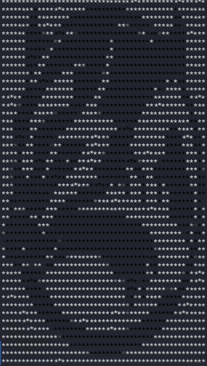
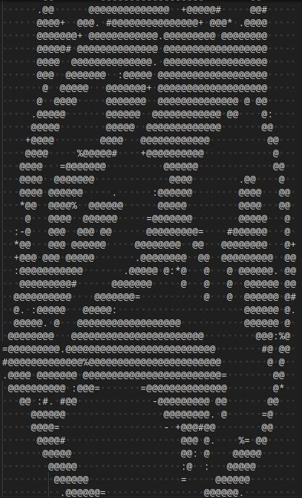

# Image to ASCII Converter

## Description

C++ program that converts an image to ASCII art & displays the image with `*` that have colors associated with the image pixel's colors.

> The ASCII text is outputted into a local `./image_2_ascii.txt` file.

```diff
- Change asteriks to full code block (\u2588) for better results
	- █ = \u2588
```

## 3rd Party Libraries

* [CImg](https://www.cimg.eu/) - Used to read image files

## Example





## Usage

> Only works on Linux
```sh
./a.out <image> [width] [height]
```

* The `width` and `height` are optional arguments that specify the size of the image to be displayed.
* If no `width` or `height` is specified, the image will be proportionally resized to fit in the terminal.
* If no `height` is specified, the image will use `width` as a percent (100 being 100% of the image size, so it wouldn't resize).

## Compile

```sh
g++ ./img_2_ascii.cpp -o ./img_2_ascii.out -I../lib/CImg/ -O2 -L/usr/X11R6/lib -lm -lpthread -lX11
```